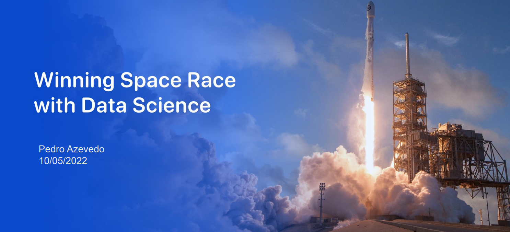

# Project : - Space X Rocket crash prediction

The results of this project are explained in the detailed **power point presentation thats saved as a PDF in this repo.**

## Project Summary

- Data was collected from public SpaceX API and by scrapping SpaceX Wikipedia
page and used Beautiful soup library for it.

- Labels were created for the column ‘Class’ which denotes all the successful
landings.

- EDA (Exploratory Data Analysis) using SQL using notebooks Watson Studio and
magicSQL

- Explored Queries using group by ,aggregate functions.

- Processed the data and cleared it

- Trained different Machine Learning algorithms to predict a successful landing

### Motive

 SpaceX advertises Falcon 9 rocket launches on its website with a cost of 62 million dollars; other providers cost upward of 165 million dollars each, much of the savings is because SpaceX can reuse the first stage. 
 
 Therefore if we can determine if the first stage will land, we can determine the cost of a launch.

  This information can be used if an alternate company wants to bid against SpaceX for a rocket launch.

  Sucessfull Launch
  

  Failed Launch

  

  ### Scope
  This project was made in the scope of the Capstone project for the IBM  Professional Data Scientist certification.

  This is divided into multiple labs/ stages

  ## Data Collection
  
  This is divided into two notebooks. 
  
  **The first one scrapes the data using the SpaceX API on their website.** 
   

*   Request to the SpaceX API
*   Clean the requested data
*   Data wrangling and formating.

**The second one uses beautifull soup and manually extracts the data** 

Web scrap Falcon 9 launch records with `BeautifulSoup`:

*   Extract a Falcon 9 launch records HTML table from Wikipedia
*   Parse the table and convert it into a Pandas data frame

## Data Wrangling & EDA

The goal here was to perform some Exploratory Data Analysis (EDA) to find some patterns in the data and determine what would be the label for training supervised models.

**Perform exploratory  Data Analysis and determine Training Labels**

*   Exploratory Data Analysis
*   Determine Training Labels

Here I define the target to predict if the rocket will land or not

## SQL EDA 
In this notebook I connected the data collected to a IBM Db2 database and ran SQL querries in order to gain insights.

The goal of this notebook was to:
1.  Understand the Spacex DataSet
2.  Load the dataset  into the corresponding table in a Db2 database
3.  Execute SQL queries to answer assignment questions

## Data Analysis / Feature Engineering

The goal here was to perform exploratory Data Analysis and Feature Engineering using `Pandas` and `Matplotlib`

*   Exploratory Data Analysis
*   Preparing Data  Feature Engineering

## Map localization Analysis
Here I performed more interactive visual analytics using `Folium`. 

This way we could extract insights from the geographical map such as were the most sucessfull landings are, and their surrondings like sea, rails etc...

Tasks:

*   **TASK 1:** Mark all launch sites on a map
*   **TASK 2:** Mark the success/failed launches for each site on the map
*   **TASK 3:** Calculate the distances between a launch site to its proximities

## Machine Learning predictions

The goal here was to 

*   create a column for the class
*   Standardize the data
*   Split into training data and test data

\-Find best Hyperparameter for multiple machine learning algorithms such as  SVM, Classification Trees and Logistic Regression

*   Find the method performs best using test data

## Webapp Visualization 
At the end a plotly webapp was created to show the findings.
